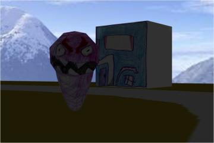

# Zombie splatting game

Game with hand-drawn zombies and buildings.

## Playing the game

* [&mdash;&nbsp;Play the game here!&nbsp;&mdash;](https://bennorth.github.io/zombie-3d-game/)

Turn yourself with the left and right arrows.  Move forward with the
up arrow and move backward with the down arrow.  You can only go on
the paths (grey), the park (green) and the zoo (purple).  If it seems
like you're stuck, you're probably just caught on a corner so move
back a bit or turn round and try again.

Fire with spacebar, but don't run out of bullets!  Get more bullets by
going to the supermarkets.  You can't re-stock from the same
supermarket without going to the other one first, or splatting a
zombie.

A zombie will chase you if you trespass into its territory.  You can
only shoot a zombie if you're quite close to it.  The zombies will
respawn but not until you've splatted others.

## Implementation

The artwork is mostly done by my youngest (age 6), with one or two
bits done by me.  She also designed the map and digitised it (using
GIMP) to give the ground plane.  For 3D modelling, I used Blender.
The JavaScript 3D engine is [Babylon](http://www.babylonjs.com/).
Skybox texture courtesy of
[3delyvisions](http://3delyvisions.co/skf1.htm).

The git history is not particularly instructive so I have just pushed
[the `gh-pages` branch](https://github.com/bennorth/zombie-3d-game).

### Potential further work

Shadows would help quite a lot, and the lighting in general could be
better.  There might be improvements to the gameplay mechanics.
Difficulty could increase as you splat more zombies.  High-score
table.  Populate the zoo.  Fix any bugs which might still exist.
